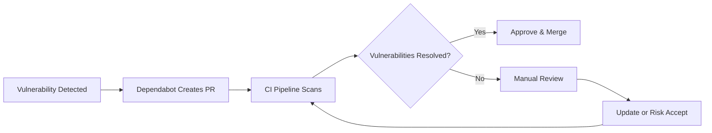

# Vulnerability Management Workflow

## Overview

This document outlines the automated vulnerability management lifecycle implemented in this project.

---

## Vulnerability Lifecycle

### 1. **Detection**

Vulnerabilities are detected through:

- **Dependabot** - Automated dependency scanning
- **Trivy** - Container and filesystem scanning
- **Scheduled Scans** - Daily automated scans via GitHub Actions
- **PR Scans** - Every pull request is scanned

### 2. **Triage**

Vulnerabilities are categorized by severity:

| Severity | Action | Timeline |
|----------|--------|----------|
| CRITICAL | Immediate fix required | < 24 hours |
| HIGH | Priority fix | < 7 days |
| MEDIUM | Scheduled fix | < 30 days |
| LOW | Best effort | Next release |

### 3. **Remediation**

**Automated Remediation:**
- Dependabot creates PRs with version updates
- Automated testing validates fixes
- CI/CD pipeline re-scans for confirmation

**Manual Remediation:**
- Security team reviews complex vulnerabilities
- Custom patches for non-patchable vulnerabilities
- Risk acceptance for false positives

### 4. **Validation**

Every fix is validated through:

```yaml
1. Dependency scan (Trivy/Snyk)
2. Container image scan
3. Integration tests
4. Security gate check
```

### 5. **Deployment**

- Only vulnerability-free code reaches production
- Security gates enforce policy compliance
- Failed scans block merges

---

## Patch Management Strategy

### Dependency Updates

**Philosophy:** Keep dependencies up-to-date proactively

- Daily scans for npm and pip packages
- Weekly Docker base image updates
- Automated PRs for security patches
- Version pinning for stability

### Update Process



### Emergency Patches

For critical zero-day vulnerabilities:

1. **Immediate Response** (< 2 hours)
   - Alert security team
   - Assess impact
   - Begin patching

2. **Rapid Deployment** (< 24 hours)
   - Fast-track PR review
   - Emergency deployment approval
   - Production rollout

3. **Post-Incident Review**
   - Document response
   - Update runbooks
   - Improve detection

---

## Severity Thresholds

### Pipeline Behavior

```yaml
CRITICAL:
  - Exit Code: 1 (fail pipeline)
  - Block: Merge & Deployment
  - Notify: Security team + Management

HIGH:
  - Exit Code: 1 (fail pipeline)
  - Block: Merge & Deployment
  - Notify: Security team

MEDIUM:
  - Exit Code: 0 (warning only)
  - Block: None
  - Notify: Development team

LOW:
  - Exit Code: 0 (informational)
  - Block: None
  - Notify: None
```

### Threshold Configuration

Adjust thresholds in `.github/workflows/vulnerability-pipeline.yml`:

```yaml
severity: 'CRITICAL,HIGH'  # Fail on these
exit-code: '1'             # Block pipeline
```

---

## CI/CD Enforcement Logic

### Security Gates

**Pre-Merge Gates:**
1. All dependency scans must pass
2. Container image scans must pass
3. No CRITICAL or HIGH vulnerabilities
4. Security team approval for exceptions

**Pre-Deployment Gates:**
1. All previous gates passed
2. Production image rescanned
3. Runtime security policies verified
4. Compliance requirements met

### Pipeline Stages

```yaml
Stage 1: Dependency Scan
  ↓ (must pass)
Stage 2: Container Scan
  ↓ (must pass)
Stage 3: Security Gate Check
  ↓ (must pass)
Stage 4: Deployment (if main branch)
```

### Failure Handling

**When Pipeline Fails:**

1. **Automated Response**
   - Pipeline stops immediately
   - Detailed scan results uploaded to GitHub Security
   - Notifications sent

2. **Developer Action Required**
   - Review scan results
   - Update dependencies or fix code
   - Push new commit
   - Re-run pipeline

3. **Security Team Escalation**
   - If fix not available
   - For complex vulnerabilities
   - Risk acceptance decision needed

---

## Scan Types

### Filesystem Scan (Trivy)

Scans source code dependencies:

```bash
trivy fs ./app --severity CRITICAL,HIGH
```

**Detects:**
- Vulnerable npm packages
- Vulnerable Python packages
- Configuration issues

### Container Image Scan (Trivy)

Scans Docker images:

```bash
trivy image vuln-demo:latest --severity CRITICAL,HIGH
```

**Detects:**
- Vulnerable OS packages
- Vulnerable application dependencies
- Misconfigurations

### SARIF Integration

Results uploaded to GitHub Security tab:

```yaml
- uses: github/codeql-action/upload-sarif@v3
  with:
    sarif_file: 'trivy-results.sarif'
```

---

## Best Practices

### For Developers

1. **Keep Dependencies Updated**
   - Review Dependabot PRs promptly
   - Test updates in development first
   - Don't ignore security warnings

2. **Use Pinned Versions**
   - Lock exact versions in production
   - Use ranges in development
   - Document version requirements

3. **Minimize Dependencies**
   - Audit dependencies regularly
   - Remove unused packages
   - Prefer well-maintained libraries

### For Security Teams

1. **Monitor Trends**
   - Track vulnerability metrics
   - Identify repeat issues
   - Measure time-to-remediate

2. **Tune Scanners**
   - Adjust severity thresholds
   - Whitelist false positives
   - Add custom rules

3. **Maintain Runbooks**
   - Document response procedures
   - Keep contact lists updated
   - Practice incident response

---

## Metrics & Reporting

### Key Metrics

- **Mean Time to Detect (MTTD):** < 24 hours
- **Mean Time to Remediate (MTTR):** 
  - CRITICAL: < 24 hours
  - HIGH: < 7 days
- **Vulnerability Backlog:** < 10 open issues
- **False Positive Rate:** < 5%

### Reports Generated

1. Daily scan summaries
2. Weekly vulnerability trends
3. Monthly compliance reports
4. Quarterly security reviews

---

## Tools Comparison

| Tool | Strengths | Use Case |
|------|-----------|----------|
| **Trivy** | Fast, accurate, open-source | Primary scanner |
| **Snyk** | Developer-friendly, fix guidance | Secondary validation |
| **Grype** | Database coverage | Alternative scanner |
| **Dependabot** | GitHub native, auto-PRs | Dependency updates |

---

## Compliance & Governance

### Policy Compliance

- **PCI-DSS:** Requirement 6.2 (Patch Management)
- **SOC 2:** CC7.1 (Security Monitoring)
- **ISO 27001:** A.12.6.1 (Technical Vulnerabilities)

### Audit Trail

All vulnerability management activities logged:

- Scan results in GitHub Security
- PR comments with findings
- Approval decisions documented
- Deployment logs retained

---

## Continuous Improvement

### Regular Reviews

- **Weekly:** Team review of open vulnerabilities
- **Monthly:** Process improvements
- **Quarterly:** Tool evaluation
- **Annually:** Strategy refresh

### Feedback Loop

```
Detection → Remediation → Validation → Retrospective → Improved Detection
```

---

## Resources

- [Trivy Documentation](https://aquasecurity.github.io/trivy/)
- [Dependabot Documentation](https://docs.github.com/en/code-security/dependabot)
- [OWASP Dependency Check](https://owasp.org/www-project-dependency-check/)
- [CVE Database](https://cve.mitre.org/)

---

**Last Updated:** December 2025  
**Version:** 1.0  
**Owner:** DevSecOps Team
